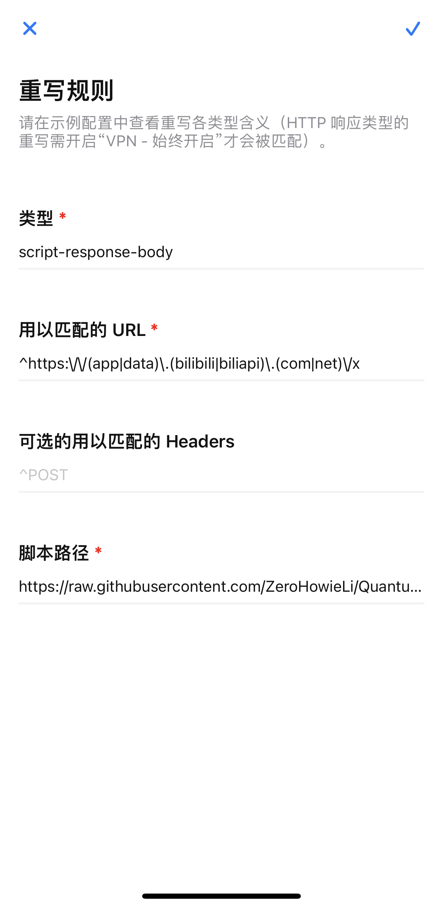
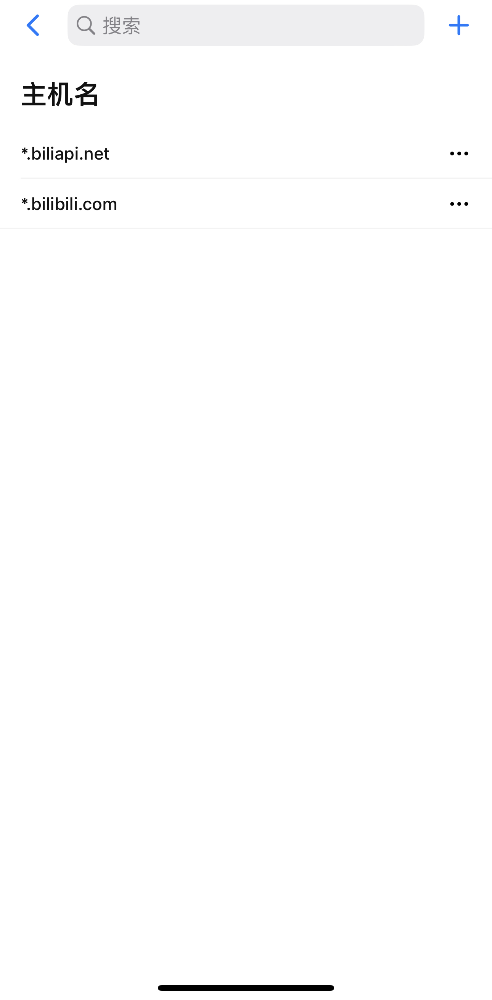
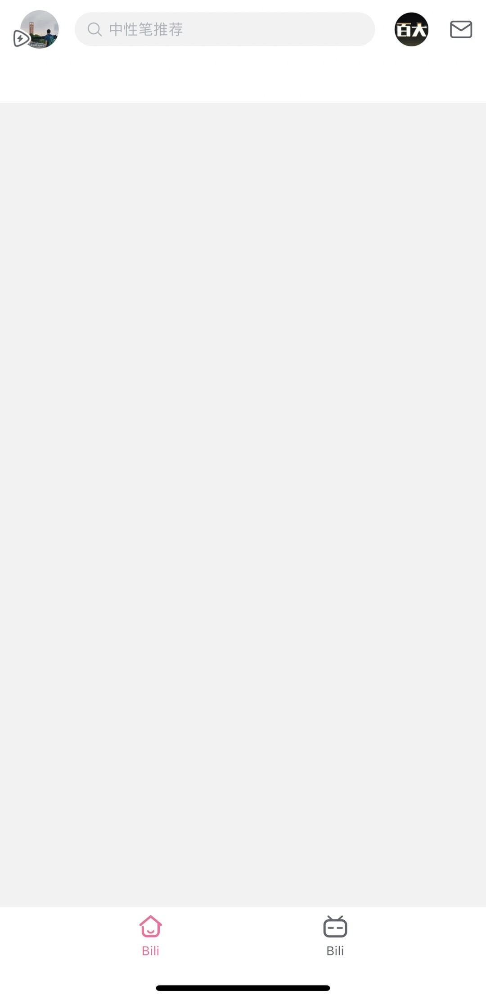

# 脚本功能
基于 `Quantumult-X` 屏蔽一些 `Bilibili` 不需要的功能，比如推荐流、底部按钮只保留首页+我的、热搜榜、开屏广告，基本只保留搜索框+我的。

对`JS`不是很熟，代码可能不够优雅，欢迎 `PR`

# Quantumult-X配置

- `URL` 正则: `^https:\/\/(app|data)\.(bilibili|biliapi)\.(com|net)\/x`
- 脚本路径: `https://raw.githubusercontent.com/ZeroHowieLi/Quantumult-X-Scripts/main/bilibili.js`
- `Mitm`主机: `*.biliapi.net`、`*.bilibili.com`

## 界面配置

`重写规则`中配置:




`Mitm -> 主机名`中配置(此处配置好证书，才会生效):



## 配置文件配置

```shell
[rewrite_local]
^https:\/\/(app|data)\.(bilibili|biliapi)\.(com|net)\/x url script-response-body https://raw.githubusercontent.com/ZeroHowieLi/Quantumult-X-Scripts/main/bilibili.js

[mitm]
hostname = *.biliapi.net, *.bilibili.com
```


# 注意事项

因为拦截了一些资源相关的数据，比如按钮，这些资源类一般App都会缓存，所以配置完后可能不会全部生效，应该需要退出APP几次，或者完全卸载后重装。


# 最终效果

